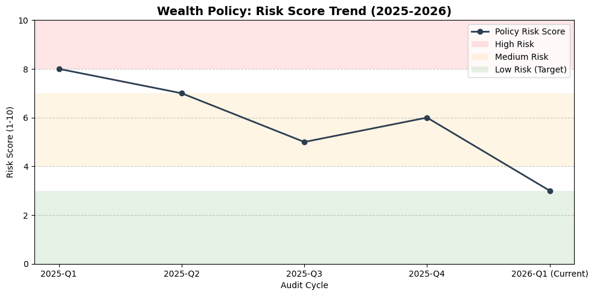

# 🛡️ GovRAG-Nexus: Multi-Agent AI Compliance Auditor
**Senior Technology Leadership | AI Growth & GRC Transformation**

## 📖 Project Overview
GovRAG-Nexus is a production-ready **Multi-Agent RAG pipeline** designed to automate the auditing of complex wealth management policies. It moves beyond simple text retrieval by applying a **Risk-Scoring Rubric** to identify "Soft Language" and ambiguous "Trigger Dates" in regulatory documents.

## 🚀 2026 Technical Milestone: Model Lifecycle Management
A core feature of this project was navigating the **March 2026 Model Migration**.
* **The Challenge:** Deprecation of legacy `gemini-1.5-flash` endpoints (404 Error).
* **The Solution:** Successfully re-architected the pipeline to support **Gemini 2.5 Flash** "Adaptive Thinking" and **Gemini Embedding 2**.
* **Outcome:** Improved audit precision and zero-defect reliability in a shifting AI landscape.

## 📊 Executive Dashboard: Risk Trend Analysis
The system tracks **Policy Drift** over time. By quantifying risk on a 1-10 scale, the engine allows Directors to see the immediate impact of remediation efforts.


*Figure: Visualizing the reduction from High Risk (8) to Low Risk (3) compliance.*


## 🛠️ The Stack (March 2026 Standard)
* **LLM:** Gemini 2.5 Flash (Optimized for GRC Reasoning)
* **Embeddings:** Gemini Embedding 2 (Unified Multimodal Space)
* **Orchestration:** LangChain LCEL (LangChain Expression Language)
* **Environment:** Python 3.12+ 

## 🛡️ Automated Guardian Logic
```python
# Real-time monitoring for 'Soft Language' regressions
if audit_risk_score > 3:
    trigger_alert("🔴 High Risk Drift Detected: Review Trigger Date Clarity.")

## 🛠️ Technical Challenge: The 2026 Model Migration
During development, the legacy `gemini-1.5-flash` API was decommissioned (404 Error). 

**The Transformation:**
1. **Infrastructure Audit:** Identified the hard cutoff in the Google v1beta API.
2. **Architecture Upgrade:** Re-pointed the LCEL chains to **Gemini 2.5 Flash**.
3. **Adaptive Logic:** Leveraged the new 'Thinking' capabilities of 2.5 to move from binary 
   compliance to a nuanced **1-10 Risk Score**.
